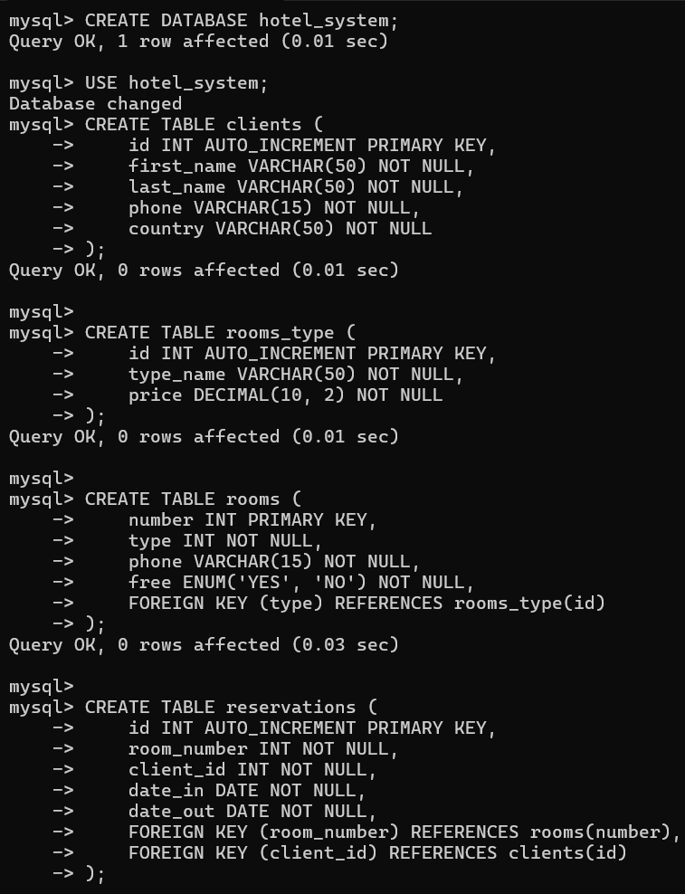
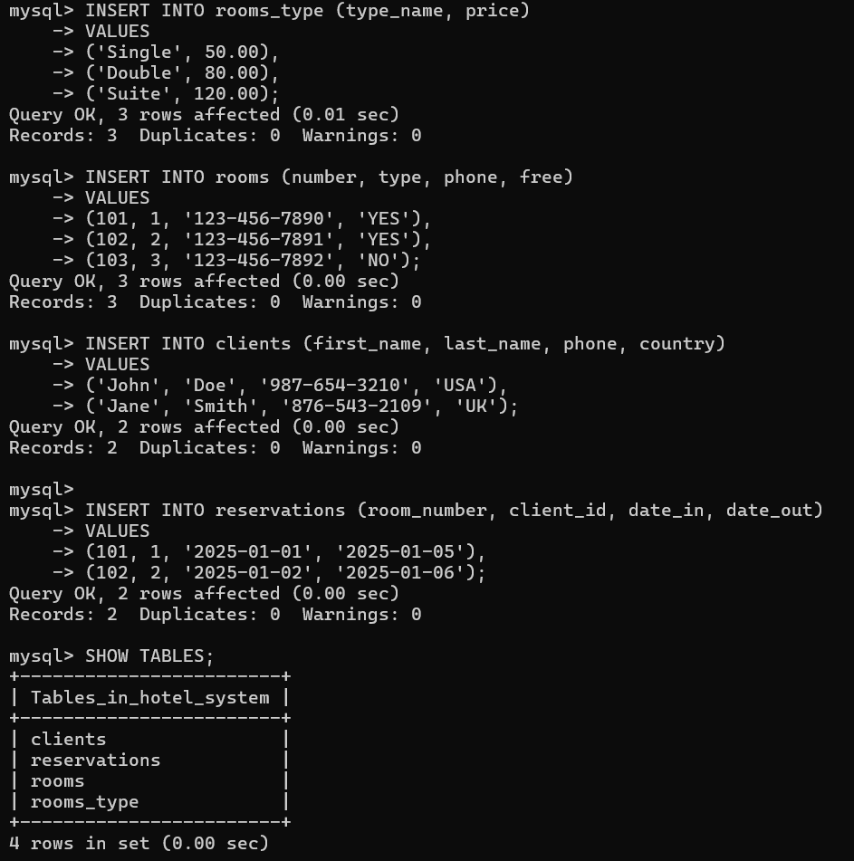
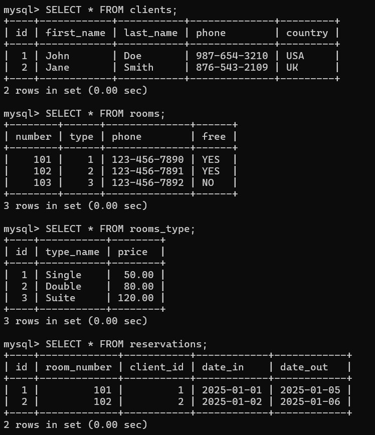

```markdown
# Hotel Management System

Welcome to the **Hotel Management System**, a comprehensive solution for managing hotel operations. This application is designed to handle client information, room details, reservations, and user roles (Admin and Receptionist). It provides a user-friendly interface for managing all aspects of hotel operations efficiently.

## Table of Contents

- [Overview](#overview)
- [Features](#features)
- [Installation](#installation)
- [Usage](#usage)
- [Database Setup and Screenshots](#database-setup-and-screenshots)
  - [Creating the Database and Tables](#creating-the-database-and-tables)
  - [Inserting Records into Tables](#inserting-records-into-tables)
  - [Selecting Data from Tables](#selecting-data-from-tables)
- [Contributing](#contributing)
- [License](#license)

## Overview

The **Hotel Management System** is a robust application tailored for hotel operations. It provides a user-friendly interface for managing clients, rooms, reservations, and user roles. Built with simplicity and efficiency in mind, this system integrates seamlessly with a MySQL database to ensure data persistence and reliability.

### Technical Stack:
- **Backend**: C# (Console Application)
- **Database**: MySQL
- **Library**: MySql.Data for MySQL integration

## Features

- **Client Management**: Add, edit, and delete client information.
- **Room Management**: Manage room details, including room type, availability, and pricing.
- **Reservation Management**: Handle room bookings, check-in/check-out dates, and client reservations.
- **User Roles**: Two types of users—Admin and Receptionist—with different access levels.
- **Database-Driven**: All data is stored in a MySQL database for secure and persistent storage.
- **Console Interface**: A simple and intuitive command-line interface ensures ease of use for hotel staff.

## Installation

Follow these steps to set up and run the **Hotel Management System** on your local machine.

### Prerequisites

- **.NET SDK**: Download and install the .NET SDK from [here](https://dotnet.microsoft.com/download).
- **MySQL Database**: Install MySQL from [here](https://dev.mysql.com/downloads/installer/). Ensure the MySQL server is running before starting the application.
- **MySQL Connector**: The application uses the `MySql.Data` package for database connectivity.

### Setup Instructions

1. Clone the repository:
   ```bash
   git clone https://github.com/Al-Edrisy/hotel-reservation-system.git
   cd hotel-reservation-system
   ```

2. Set up the database:
   - Open MySQL Workbench or the command line and execute the following script to create the database and tables:
     ```sql
     CREATE DATABASE hotel_system;
     USE hotel_system;

     -- Create clients table
     CREATE TABLE clients (
       id INT AUTO_INCREMENT PRIMARY KEY,
       first_name VARCHAR(50) NOT NULL,
       last_name VARCHAR(50) NOT NULL,
       phone VARCHAR(15) NOT NULL,
       country VARCHAR(50) NOT NULL
     );

     -- Create rooms_type table
     CREATE TABLE rooms_type (
       id INT AUTO_INCREMENT PRIMARY KEY,
       type_name VARCHAR(50) NOT NULL,
       price DECIMAL(10, 2) NOT NULL
     );

     -- Create rooms table
     CREATE TABLE rooms (
       number INT PRIMARY KEY,
       type INT NOT NULL,
       phone VARCHAR(15) NOT NULL,
       free ENUM('YES', 'NO') NOT NULL,
       FOREIGN KEY (type) REFERENCES rooms_type(id)
     );

     -- Create reservations table
     CREATE TABLE reservations (
       id INT AUTO_INCREMENT PRIMARY KEY,
       room_number INT NOT NULL,
       client_id INT NOT NULL,
       date_in DATE NOT NULL,
       date_out DATE NOT NULL,
       FOREIGN KEY (room_number) REFERENCES rooms(number),
       FOREIGN KEY (client_id) REFERENCES clients(id)
     );

     -- Create users table
     CREATE TABLE users (
       id INT AUTO_INCREMENT PRIMARY KEY,
       username VARCHAR(50) NOT NULL UNIQUE,
       password VARCHAR(255) NOT NULL,
       role ENUM('Admin', 'Receptionist') NOT NULL
     );
     ```

3. Configure the database connection:
   - Open the `DBConnection.cs` file and update the connection string with your MySQL credentials:
     ```csharp
     public string GetConnection()
     {
         return "Server=localhost;Database=hotel_system;Uid=root;Pwd=yourpassword;";
     }
     ```

4. Install the `MySql.Data` NuGet package:
   ```bash
   dotnet add package MySql.Data
   ```

5. Build and run the application:
   ```bash
   dotnet build
   dotnet run
   ```

## Usage

Once the application is set up, you can interact with it via the console interface to manage clients, rooms, reservations, and user roles.

### Key Operations:
- **Add a Client**: Add new client details, including first name, last name, phone number, and country.
- **Add a Room**: Add new room details, including room number, type, phone, and availability.
- **Add a Reservation**: Create a new reservation with room number, client ID, and check-in/check-out dates.
- **Manage Users**: Add users with roles (Admin or Receptionist).

### Example Commands:
- **Add a Client**:
  ```
  First Name: John
  Last Name: Doe
  Phone: 987-654-3210
  Country: USA
  ```

- **Add a Room**:
  ```
  Room Number: 101
  Room Type: 1 (Single)
  Phone: 123-456-7890
  Availability: YES
  ```

- **Add a Reservation**:
  ```
  Room Number: 101
  Client ID: 1
  Check-in Date: 2025-01-01
  Check-out Date: 2025-01-05
  ```

- **Add a User**:
  ```
  Username: admin
  Password: admin
  Role: Admin
  ```

## Database Setup and Screenshots

This section provides the SQL queries used to set up the database, insert records, and retrieve data. Screenshots of the MySQL Workbench (or command line) are included to visually demonstrate each step.

### Creating the Database and Tables

#### SQL Queries:
```sql
-- Create the database
CREATE DATABASE hotel_system;

-- Use the database
USE hotel_system;

-- Create clients table
CREATE TABLE clients (
  id INT AUTO_INCREMENT PRIMARY KEY,
  first_name VARCHAR(50) NOT NULL,
  last_name VARCHAR(50) NOT NULL,
  phone VARCHAR(15) NOT NULL,
  country VARCHAR(50) NOT NULL
);

-- Create rooms_type table
CREATE TABLE rooms_type (
  id INT AUTO_INCREMENT PRIMARY KEY,
  type_name VARCHAR(50) NOT NULL,
  price DECIMAL(10, 2) NOT NULL
);

-- Create rooms table
CREATE TABLE rooms (
  number INT PRIMARY KEY,
  type INT NOT NULL,
  phone VARCHAR(15) NOT NULL,
  free ENUM('YES', 'NO') NOT NULL,
  FOREIGN KEY (type) REFERENCES rooms_type(id)
);

-- Create reservations table
CREATE TABLE reservations (
  id INT AUTO_INCREMENT PRIMARY KEY,
  room_number INT NOT NULL,
  client_id INT NOT NULL,
  date_in DATE NOT NULL,
  date_out DATE NOT NULL,
  FOREIGN KEY (room_number) REFERENCES rooms(number),
  FOREIGN KEY (client_id) REFERENCES clients(id)
);

-- Create users table
CREATE TABLE users (
  id INT AUTO_INCREMENT PRIMARY KEY,
  username VARCHAR(50) NOT NULL UNIQUE,
  password VARCHAR(255) NOT NULL,
  role ENUM('Admin', 'Receptionist') NOT NULL
);
```

#### Screenshot:
  

---

### Inserting Records into Tables

#### SQL Queries:
```sql
-- Insert sample data into rooms_type table
INSERT INTO rooms_type (type_name, price)
VALUES 
('Single', 50.00),
('Double', 80.00),
('Suite', 120.00);

-- Insert sample data into rooms table
INSERT INTO rooms (number, type, phone, free)
VALUES 
(101, 1, '123-456-7890', 'YES'),
(102, 2, '123-456-7891', 'YES'),
(103, 3, '123-456-7892', 'NO');

-- Insert sample data into clients table
INSERT INTO clients (first_name, last_name, phone, country)
VALUES 
('John', 'Doe', '987-654-3210', 'USA'),
('Jane', 'Smith', '876-543-2109', 'UK');

-- Insert sample data into reservations table
INSERT INTO reservations (room_number, client_id, date_in, date_out)
VALUES 
(101, 1, '2025-01-01', '2025-01-05'),
(102, 2, '2025-01-02', '2025-01-06');

-- Insert sample data into users table
INSERT INTO users (username, password, role)
VALUES 
('admin', 'admin', 'Admin'),
('reception', 'reception', 'Receptionist');
```

#### Screenshot:
  

---

### Selecting Data from Tables

#### SQL Queries:
```sql
-- Select all records from clients table
SELECT * FROM clients;

-- Select all records from rooms table
SELECT * FROM rooms;

-- Select all records from rooms_type table
SELECT * FROM rooms_type;

-- Select all records from reservations table
SELECT * FROM reservations;

-- Select all records from users table
SELECT * FROM users;
```

#### Screenshot:
  

---

## Contributing

We welcome contributions to improve the **Hotel Management System**! If you'd like to contribute, please follow these steps:

1. Fork the repository.
2. Create a new branch for your changes.
3. Make your changes and commit them.
4. Push your changes to your fork.
5. Submit a pull request with a detailed description of your changes.

---

## License

This project is licensed under the **MIT License**. For more details, see the [LICENSE](LICENSE) file.

---

Thank you for using the **Hotel Management System**! We hope it enhances your hotel operations and simplifies your management processes. If you have any questions or feedback, feel free to reach out.
```
